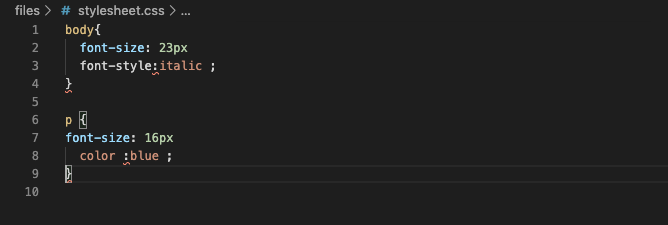
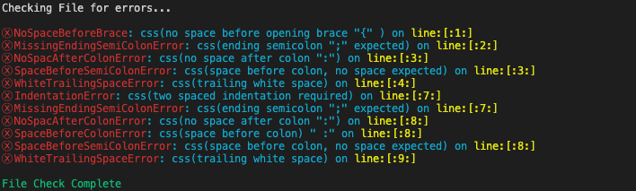
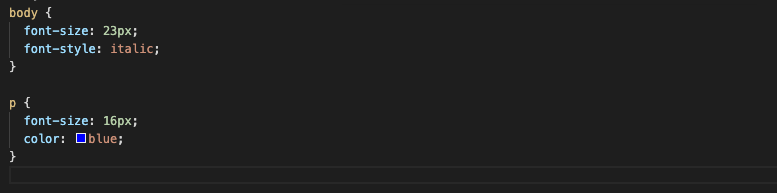

# Ruby Capstone Project- Building a Custom CSS Linter
 > A Ruby developed linter for beginners that provides feedback about errors that the user might encounter in their css file.

 > [Presentation here](https://www.loom.com/share/b559a42e007c4bbba7e8bab271ce86c5)

 ## Objective
 CSS linter is responsible for flagging the following errors:
  - *Space before opening brace error in css file*
  - *Missing of an ending semicolon when defining a property and its value*
  - *No space after a colon when defining a properties value*
  - *Indentation errors*
  - *White trailing space errors*

 ## Built With

- Ruby
- VSCode
- Terminal
- Linter

## Getting Started

**The project was designed to test capalities of using Object Oriented Programming in Ruby**
- **Ruby Enviroment**: if you do not have ruby installed visit this [link](https://www.ruby-lang.org/en/documentation/installation/) to install

- **Terminal(Mac & Linux) or Command Prompt(Windows)**:
 - Clone the repository to your local machine
 - Go to the bin file directory and locate the linter file
 - In the Shell run ln -s $PWD/checker /usr/local/bin/ or sudo ln -s $PWD/checker /usr/local/bin/
 - **NOTE**: If you have issues installing click [here](https://commandercoriander.net/blog/2013/02/16/making-a-ruby-script-executable/) for guidelines

- **Understanding the files and Content**
 - linter.rb : Main file responsible for running the application.
 - user_file.rb : Contains a UserFile class that is responsible for reading the contents of CSS file provided by user.
 - css_inspector : Contains the CSSInspectorTool class that is responsible for inspecting the content of the CSS file provided by the user.
 - module_errors.rb : Contains the Errors module which consists of several methods responsible for manipulating the file content provided by the user.

- **Running the program**
  - After a succesful installation, go into your shell and run linter "filename.css".
  - Ensure your follow the right path of the css file you are trying to scan of errors e.g "./users/user/desktop/files/filename.css"

## Example
**File: stylesheet.css (Bad Code)**

**Result**

**File: stylesheet.css (Good Code)**

## Author 

👤 **Elbie Moonga**

- GitHub: [@Elbie-Em](https://github.com/Elbie-em)
- Twitter: [ElbieEm](https://twitter.com/ElbieEm)
- LinkedIn: [elbie-moonga](https://www.linkedin.com/in/elbie-moonga-253bbb12b/)

## 🤝 Contributing

Contributions and issues are welcome!

Feel free to check the issues page [here](https://github.com/Elbie-em/Ruby-Capstone-Project---Building-a-Custom-CSS-Linter/issues).

## Show your support

Give me a ⭐️ if you like this project!

## Acknowledgments

- [Microverse](microverse.org)
- [Ruby DOCS](https://ruby-doc.org/stdlib-2.6.1/libdoc/strscan/rdoc/StringScanner.html)
- [Rubular Ruby Regular Expression editot](https://rubular.com/)
